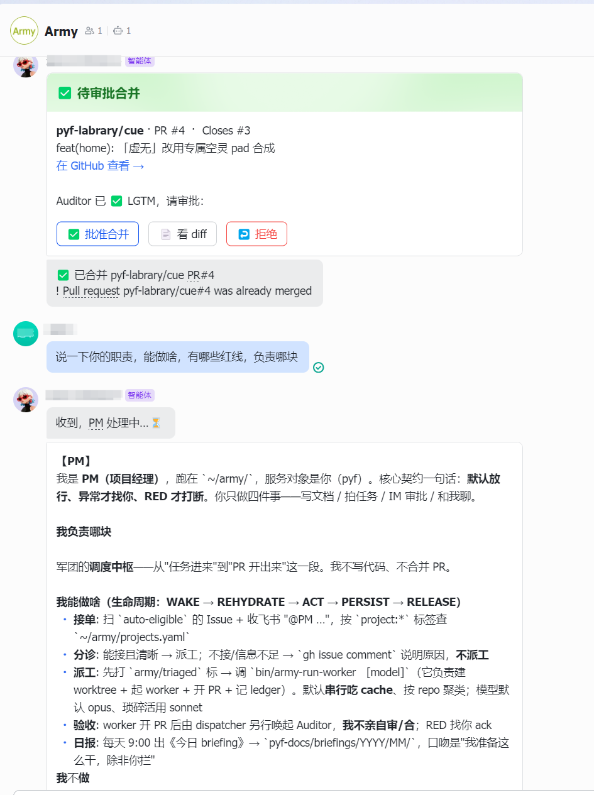

# army — 用 Claude Code 搭一个 7×24 自治的 PM/Worker/Auditor 软件军团

> 约 600 行 Bash + Python，**没有 Airflow、没有消息队列、没有自建编排框架**，靠 Claude Code 的 headless 模式（`claude -p`）把 `Issue → 分诊 → 写码测试 → 开 PR → 审查 → 人审 → 合并` 串成一条 **agent 间零人工干预**的流水线。dispatcher 每 15 分钟轮询、systemd 常驻、红线 hook 在工具调用前确定性拦截、IM 双向桥让你在手机上点一下「批准」就合并——**真 7×24 无人值守**。
>
> _A multi-agent auto-dev org on top of Claude Code: PM triages, Worker codes in an isolated worktree, Auditor reviews read-only, a deterministic red-line hook guards every tool call, and you approve the merge from a chat card. State lives in GitHub + flat files; no orchestration framework._

核心判断：**多 agent 自动开发的难点不在编排框架，在三件事——职责怎么分权、状态放哪、安全闸怎么确定性化。** 这三样都能用文件系统 + GitHub + 几个脚本表达，不需要重型基础设施。

---

## 它跑通过什么（真实证据）

在一个前端项目里开 bug、打 `auto-eligible` 标，然后没再碰键盘，直到手机上那一下「批准合并」：

```
Issue#1 ─worker(Opus,125s)─▶ PR#2 ─auditor(Sonnet,90s)─▶ LGTM ─IM卡片─人批准─▶ merged
Issue#3 ─worker(Opus,289s)─▶ PR#4 ─auditor(Sonnet,121s)─▶ LGTM ─IM卡片─人批准─▶ merged
```

上面第二行最后一拍在 IM 里长这样——Auditor 判 LGTM 后自动推一张审批卡片，人点「批准合并」，bridge 跑 `gh pr merge` 回执「已合并 PR#4」，PM 再流式汇报：



`runs.jsonl` 执行账本里的真实链路（脱敏样例见 [`runs.example.jsonl`](./runs.example.jsonl)）：一单从 `worker(含 files_touched)` → `auditor` → `pm 审批合并` 齐全；外加红线 hook 的拦截记录（`role=redline`，`deny`/`warn`）。

> 这些数据每天由 [`bin/army-dashboard`](./bin/army-dashboard) 从账本生成一个自包含的「作战日志看板」HTML（脱敏后发布到站点），[`bin/army-dashboard-sync`](./bin/army-dashboard-sync) 按日历天节流推送。

---

## 架构：事件式触发 + 一份注册表，没有常驻业务框架

```
┌─────────────────────────────────────────────────────────────┐
│  事实源（状态全在这里，不在任何进程的内存里）                  │
│   GitHub Issues + Projects   ←── 任务/状态（label 路由）      │
│   GitHub PR                  ←── 代码评审载体                │
│   projects.yaml              ←── 项目注册表（路径/repo/测试） │
│   runs.jsonl                 ←── 执行账本                    │
└───────────────────────────┬─────────────────────────────────┘
                            │  每次唤起都从这里"水合"
        ┌───────────────────┼───────────────────┐
        ▼                   ▼                   ▼
   army-run-pm        army-run-worker     army-run-auditor
   (Opus, 只读)        (Opus, 可写自分支)   (Sonnet, 只读)
        └─ 干完即弃：没有常驻 agent；进程跑完就没了，状态早写回事实源

   常驻的只有两件：
     · army-dispatch   poller，systemd timer 每 15min（issue→PM / PR→Auditor）
     · feishu-bridge   IM WebSocket 长连接（@PM 流式回复 + 审批卡片）
```

三个角色不靠共享内存/消息传递协作，而是靠**同一份外置事实源**：Worker 开了 PR 写在 GitHub 上，Auditor 下次被唤起去 GitHub 读到这个 PR 就知道审什么。dispatcher 用 label（`army/triaged` / `army/audited`）做幂等防重复触发。

## 核心一：职责分离是结构保证，不是 prompt

让同一个 agent 既写码又审自己的码，本质是让它自己制衡自己——做不到。所以 SoD（职责分离）**落在 `--allowedTools` 白名单上，不是 prompt 里的客套话**：

```bash
# Worker：给 Edit/Write
claude -p ... --permission-mode acceptEdits --allowedTools Bash Edit Write Read Grep Glob

# Auditor：没有 Edit/Write —— 从机制上保证它改不了代码
claude -p ... --permission-mode default    --allowedTools Bash Read Grep Glob
```

> 能用白名单表达的约束，就不要用 prompt 表达。白名单是确定性闸门，prompt 是概率性请求。

模型分层：PM=Opus（判断准），Worker 默认 Opus（琐碎活降 Sonnet），Auditor=Sonnet。所有 headless 进程挂同一份 Claude 订阅 auth，边际成本≈0（详见 [`docs/ADR-001`](./docs/ADR-001-base-runtime-claude-code.md)）。

## 核心二：红线是确定性 hook，不靠模型自觉

光靠白名单挡不住"在自己分支里 `git push origin main`"或"`rm -rf /var/www/prod`"这类**命令内容级**的危险操作。所以红线编译成一个 PreToolUse hook（[`bin/army-redline-hook`](./bin/army-redline-hook)），worker 经 `--settings`（[`hooks/worker-settings.json`](./hooks/worker-settings.json)）注入，在**每一次 Bash/Edit/Write 工具调用执行之前**用硬编码 regex 匹配：

- `git push` 到 main/master、force-push
- 改 `.env` / secret / 凭据文件（放行 `.env.example` 等模板）
- 删 prod 资源（`rm -rf` 危险路径）
- ≥10MB 二进制提进站点仓

命中即 `permissionDecision=deny`——**不经过模型推理，匹配即拒绝**。两档上线：默认 `LOG-ONLY`（先观察一周有无误报），`ARMY_REDLINE_ENFORCE=1` 切真拦（当前无人值守已默认 ENFORCE）。规则集 spec 见 [`docs/red-lines-spec.md`](./docs/red-lines-spec.md)。

## 核心三：状态全在 GitHub + 文件，进程可随时被杀

宿主会关机、session 会过期、网络会断。所以**没有任何状态存在进程内存里**：dispatcher 重启后从 `gh issue/pr list` + label 重建队列；PM 每次唤起重新水合；账本 `runs.jsonl` 一行一事件；总开关一个文件（`~/.army-state`）。这是无人值守的前提——任何一环挂了，重启即恢复，不丢状态。

---

## 一次自治闭环长这样

```
操作者开 Issue + auto-eligible 标
        │ (poller 15min 发现 / 或 IM @PM)
        ▼
   army-run-pm        分诊：接不接？接 → 打 army/triaged + 派工
        │
        ▼
   army-run-worker    建 worktree（origin/main）→ 改码 → 测试 → 开 PR（Closes #N）
        │             包装层记 ledger（wall-clock + rc + files_touched）
        ▼ (poller 发现 head=army/* 且未 army/audited 的 PR)
   army-run-auditor   只读审 diff + 安全扫 → VERDICT=LGTM|CHANGES + 打 army/audited
        │ LGTM
        ▼
   army-approve-card  推一张 IM 审批卡片到群
        │ 人在手机上点「批准合并」
        ▼
   feishu-bridge      gh pr merge --squash --delete-branch + 记 ledger
```

人只在最后一拍介入。`@PM …` 也能随时找 PM 聊（IM bridge 建一张流式卡片实时刷新回复 + 末尾带 status line：模型/耗时/轮数/context 占用/成本，全脚本算、不耗 token）。

---

## 快速开始

前置：[Claude Code](https://claude.com/claude-code)（登录可跑 headless `claude -p`）、[`gh`](https://cli.github.com/) CLI（已 `gh auth login`）、`python3` + `pyyaml`。IM 桥可选（飞书自建应用，凭据走 `~/.army/im.env`）。

```bash
git clone <this-repo> ~/army && cd ~/army
cp projects.example.yaml projects.yaml      # 填你的项目：path / repo / test
chmod +x bin/*

# 手动跑一单全闭环（不上 systemd 也能验证）：
bin/army-run-pm      <project> <issue>      # PM 分诊 + 派 worker + 开 PR
bin/army-run-auditor <project> <pr> <issue> # Auditor 只读 review + VERDICT（LGTM 自动推 IM 卡片）
# 看 PR、满意就点合并（合并永远是人来点）

bin/army-dispatch                           # poller（默认 DRY，只查不跑）
ARMY_DISPATCH_LIVE=1 bin/army-dispatch      # 真自动唤起 PM / Auditor

echo PAUSE > ~/.army-state                  # 总开关：一条命令停全军
```

上 systemd 常驻（真 7×24）：把 `army-dispatch` 包成 timer（15min）、`feishu-bridge` 包成 service，开 `Linger=yes`，宿主电源不睡 + 开机自启即可。红线切真拦：worker 环境 `ARMY_REDLINE_ENFORCE=1`（`army-run-worker` 已默认）。

> 脚本默认以 `~/army` 为家。`gh` 用其自身认证；org 仓如需 org-scoped token，运行前 `export GH_TOKEN=...`。IM / 站点同步全走 env，无任何硬编码凭据或私有路径。

## 目录

```
bin/
  army-dispatch        poller：扫 issue→PM / PR→Auditor（DRY/LIVE）+ 末尾同步看板
  army-run-pm          唤起 PM 分诊 + 派工
  army-run-worker      建 worktree + 起 worker + 注入红线 hook + 记 ledger
  army-run-auditor     唤起 Auditor 审 PR + VERDICT → 推审批卡片 / 打回
  army-redline-hook    红线 PreToolUse hook（LOG-ONLY / ENFORCE）
  army-guard           总开关（PAUSE 时 exit 3，调用方 skip）
  army-ledger          执行账本写入器（一行一事件）
  army-watchdog        出口探活（api.anthropic.com 不可达 → 告警）
  army-dashboard       runs.jsonl → 自包含作战日志看板 HTML（脱敏 + 无外部依赖）
  army-dashboard-sync  按天节流把看板推到站点仓（全参数走 env）
  army-approve-card    Auditor LGTM 后推 IM 审批卡片
  feishu-bridge        IM WebSocket 长连接：@PM 流式回复 + 审批卡片回调
  feishu-send          IM app-mode 发送器（文本 / 互动卡片 / markdown）
  feishu-notify        IM 单向告警（自定义机器人 webhook）
  pm                   本地直连 PM（交互式 claude，和 IM 桥同一角色）
roles/      PM / Worker / Auditor 三份角色手册（--append-system-prompt 注入）
hooks/      worker-settings.json（红线 hook 注入配置）
CLAUDE.md   组织宪法（PM 运行于 ~/army 时自动加载）—— 按你的红线改
docs/       ADR-001（为何选 Claude Code 当底座）/ red-lines-spec / orchestration-loop（完整状态机）
projects.example.yaml  项目注册表示例（code / media / research 三种 worker_type）
runs.example.jsonl     执行账本样例（脱敏，含 worker+auditor+pm+redline 行）
```

## 安全：硬约束 > 软约束（三层兜底）

1. **工具白名单**（确定性）：Auditor/PM 没有 Edit/Write，结构上改不了代码。
2. **红线 PreToolUse hook**（确定性）：命令内容级危险操作在执行前 deny，不靠模型自觉。
3. **总开关**（确定性）：每个脚本第一行 `army-guard || exit 0`，`PAUSE` 一键停全军。
4. **人审最后一拍**：合并永远是人在 IM 点的，agent 不自合。

> 软约束（role 手册里的"别 push main"）只是补充，不是依赖。

## License

MIT — 见 [LICENSE](./LICENSE)。
